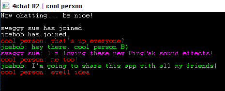

# 4chat/BlitzChat Plus
Peer to peer chat software. Kind of sucks. Do whatever you want with it, don't even have to attribute me for this one. 
## How to use

### Creating a Room
	1. Launch 4chat

	2. Under the "Connection" dropdown menu, select "Internet TCP/IP"

	3. Click "Ok"

	4. Under "Name for new game", type the desired name for your room

	5. Click "Create new game"
**NOTE**: *You may have to forward one or all of the following ports on your router/machine/network/firewall/semaphore shutter to make your 4chat room visible to others:*
```1900 | Universal Plug and Play (UPnP) - Simple Service Discovery Protocol```
```2302-2400 | DirectPlay device address default```
```2234 | Internet sharing and firewall support for Windows Millennium Edition (Windows Me) and Windows XP```
```6073 | DirectPlay enumerations using DPNSVR```
```47624 | Deprecated DirectPlay enumeration```
*Port information was found [here](https://documentation.help/DirectPlay/ports.htm) and worked the last time I tried 4chat. I am not responsible for any incursions on your network due to trying to use 4chat.*
### In the room
  	1. Follow on-screen instructions.

  	2. Press F1 to start typing a new message.

  	3. Press return to send it.

**NOTE**: *There might be issues with the receiving of messages while you're typing. This has yet to be solved (I think I know how, I just don't care since it doesn't impact the user experience of the 1 person that uses this). Maybe you, dear reader, could solve this?*
### Joining an existing room
  	1. Launch 4chat

  	2. Under the "Connection" dropdown menu, select "Internet TCP/IP"

  	3. If you know the computer name or IP of the session host, enter it here, otherwise, click "Ok".

  	4. Look for the session you wish to join from the list.

  	5. When you find the room you want, double click on it to join.

  	6. Follow the "In the room" steps.
## wAcKy FeAtUrEs!1!1
### Peer-to-peer persistence
Say you started a chatroom, and you're chatting along with lots of friends, but you have to turn off your computer because the FBI is raiding your compound. No matter! With 4chat, *everyone is a host* ```(or something like that, I'm not *really* sure how DirectPlay works, but it does, and it's pretty cool)```, therefore if someone leaves, even the person who originally started the room, the room still exists with the same name, and can still be joined in the usual way and viewed in the server list! The only difference is there's now a different "host" IP.
### PingPaks
They're sounds. You can change the files but keep the names in any of the paks to customize them. Go bonkers.
### Custom text color
Name says it all.
